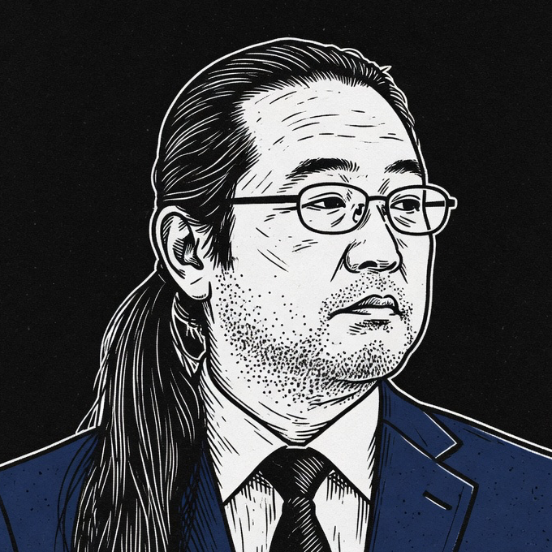

<p align="center">
  
</p>

# Prudent Ponytail

**He says nothing. He reads everything. Then Ponytail writes one line.**

Do the due diligence. Then let Ponytail do less.

**Prudent Ponytail is a preflight companion skill for [Ponytail](https://github.com/DietrichGebert/ponytail).** It decides what to change before Ponytail decides how little to write.

---

You know him. Same ponytail. Same oval glasses. A suit now.

He was young once. He shipped the perfect one-liner without reading first. It was small, it was elegant, and it worked — on every path he'd checked. There was a caller he hadn't. The postmortem had his name in it.

Now he reads first. The output hasn't changed: one line, and it works.

## How it works

Prudent Ponytail runs **before** Ponytail. Ponytail's first question is "Does this need to exist?" — Prudent Ponytail is how the agent finds out what *this* is. Before any code is written, it adds four steps:

```
1. Frame the outcome    → what must become true, what must not change, what proves it
2. Trace the path       → find the component that owns the behavior; check its callers
3. Try to disprove it   → run the cheapest check that could break the leading fix
4. Lock the decision    → scope, non-goals, and how to prove it worked
```

Then it hands off. Ponytail takes over as usual and writes the smallest change that fits the locked decision. Same diff size. Different bug count.

## When to use it

Use it before non-mechanical coding changes and root-cause investigations — whenever the required behavior, the owning component, the blast radius, or the proof of success is not already obvious.

Skip it for exact, local, mechanical, reversible edits and for non-coding work. He skips those too.

## Requirements

[Ponytail](https://github.com/DietrichGebert/ponytail) is the recommended implementation companion, but it is optional. Install it separately if you want the full handoff workflow; this repository does not bundle or modify it.

## Install

### Codex plugin

Install the marketplace and plugin with the Codex CLI:

```bash
codex plugin marketplace add mssoftjp/prudent-ponytail --ref main
codex plugin add prudent-ponytail@prudent-ponytail
```

Start a new conversation so Codex loads the installed plugin.

### Standalone skill

If you only want the skill, install it directly from GitHub with `$skill-installer`:

```text
Use $skill-installer to install https://github.com/mssoftjp/prudent-ponytail/tree/main/skills/prudent-ponytail
```

Codex detects newly installed skills automatically. If it does not appear, restart Codex. See the official OpenAI guides for [building plugins](https://learn.chatgpt.com/docs/build-plugins) and [building skills](https://learn.chatgpt.com/docs/build-skills).

### ChatGPT

For personal use in ChatGPT on the web, run `make package`, open [Skills](https://chatgpt.com/skills), choose **Create → Upload skill**, and upload the generated `dist/prudent-ponytail-skill-X.Y.Z.zip` file.

This manual skill upload is separate from public plugin distribution. To list Prudent Ponytail in the universal [Plugins Directory](https://chatgpt.com/plugins), submit the final skill bundle through the [OpenAI plugin submission portal](https://platform.openai.com/plugins) as a **Skills only** plugin. Prudent Ponytail is not yet published there.

For private workspace distribution, a workspace admin can test the plugin through a local marketplace in the ChatGPT desktop app, then [publish it to the workspace](https://developers.openai.com/plugins/build/plugins#publish-a-local-plugin-to-your-workspace).

## Usage

Invoke it explicitly when you want the preflight step:

```text
Use $prudent-ponytail to identify and lock the smallest complete intervention before implementing it with Ponytail.
```

Codex can also select the skill automatically when the task matches its description.

## What it prevents

- Editing before the path that controls the behavior is traced
- Fixing a symptom instead of the component that owns the behavior
- Repository-wide exploration that cannot change the decision
- Adjacent refactors and speculative abstractions
- Planning ceremony and review swarms for bounded changes

He has personally committed every item on this list.

## Relationship to Ponytail

An independent companion project. Not an official Ponytail extension, not affiliated with Ponytail's maintainers.

No benchmark numbers yet. He would not respect made-up ones.

## FAQ

**Is this a fork of Ponytail?**
No. It copies none of Ponytail's code and changes none of its rules — it's a separate skill that runs before them. Ponytail doesn't need a fork. He needs someone to check the callers.

**Can I use it without Ponytail?**
Yes. It decides what should change, and any agent can implement that. It just pairs best with one determined to write as little as possible.

**Doesn't all that reading cost tokens?**
He reads until the decision is locked, then stops. Every additional file has to be able to change that decision — sightseeing in the repository is explicitly against the rules.

**What if I already know the fix?**
Tell him. He'll treat it as the leading hypothesis and run one cheap check that could disprove it. He knew the fix once, too.

**Why the suit?**
There was an incident. There were meetings. Now there is a suit.

**Why "prudent"?**
It's what the incident report called him. Sarcastically. It stuck.

---

Ponytail still writes the one line. That was always his job.

## License

MIT. He read it. All of it. See [LICENSE](LICENSE). Also see the [Privacy Policy](PRIVACY.md) and [Terms of Use](TERMS.md).
